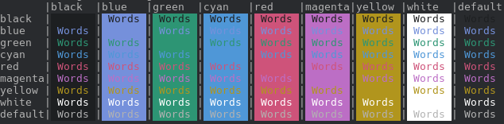

# Spacemacs Alacritty

An Alacritty theme modelled after [colepeters/spacemacs-theme.vim](https://github.com/colepeters/spacemacs-theme.vim), itself modelled after [nashamri/spacemacs-theme](https://github.com/nashamri/spacemacs-theme). 

## Getting started
### Installation

If you do not already have an Alacritty config file, place the `spacemacs.yml` file in `$XDG_CONFIG_HOME/alacritty` or any other number of paths provided in Alacritty's README. Rename this file `alacritty.yml`.

If you already have a config file, replace its color definitions with the ones in `spacemacs.yml`.

### Contribution

Please open an issue and/or a pull request for any bugs, fixes, or feature requests.

Copyright &copy; 2021-present Farrel Mahaztra

